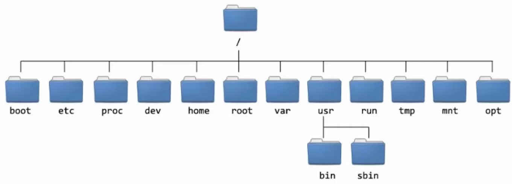

# Aula 0: Uma Introdução Prática ao Terminal Linux

Bem-vindo(a) ao terminal! Pense nele como uma forma de conversar diretamente com o computador.
Em vez de clicar em ícones, você digita comandos para dizer a ele exatamente o que fazer.
Esta é a ferramenta mais poderosa de um bioinformata.

### Entendendo o Prompt

Você verá algo como `vscode@hostname:~$`. Isso significa:
* `vscode`: Seu nome de usuário.
* `hostname`: O nome do "computador" na nuvem.
* `~`: Seu diretório "home" (sua pasta pessoal).
* `$`: Indica que o terminal está pronto para receber um comando.

---

### 1. Navegação: Onde Estou e Para Onde Vou?

Estes são os comandos essenciais para se movimentar pelo sistema de arquivos.



* **`pwd`** (Print Working Directory): Mostra o caminho completo do diretório onde você está.
    ```bash
    pwd
    ```

* **`ls`** (List): Lista o conteúdo do diretório atual.
    ```bash
    ls
    ```
    Use com "flags" para mais detalhes: `ls -lh` (lista em formato longo e legível por humanos).
    

* **`cd`** (Change Directory): Muda de diretório.
    ```bash
    cd / # Vai para a raiz do sistema
    cd ~ # Atalho para o seu diretório home
    cd .. # Vai para o diretório "pai" (um nível acima)
    cd /home/vscode # Vai para um diretório usando o caminho completo
    ```

---

### 2. Manipulação: Criando e Gerenciando Arquivos e Pastas

Vamos criar nossa própria estrutura para praticar.

* **`mkdir`** (Make Directory): Cria um novo diretório.
    ```bash
    mkdir pratica_terminal
    ```

* **`cd pratica_terminal`**: Vamos entrar no nosso novo diretório para continuar.

* **`touch`**: Cria um arquivo vazio.
    ```bash
    touch arquivo1.txt arquivo2.log
    ```

* **`cp`** (Copy): Copia arquivos ou diretórios.
    ```bash
    cp arquivo1.txt arquivo1_copia.txt
    ```

* **`mv`** (Move): Move ou renomeia arquivos e diretórios.
    ```bash
    mv arquivo2.log relatorio.log # Renomeando
    mkdir backup
    mv arquivo1_copia.txt backup/ # Movendo para o diretório backup
    ```

* **`rm`** (Remove): Remove arquivos. **CUIDADO: ESTE COMANDO É PERMANENTE!**
    ```bash
    rm relatorio.log
    ```

* **`rm -r`** (Remove Recursive): Remove um diretório e todo o seu conteúdo.
    ```bash
    rm -r backup
    ```

---

### 3. Inspeção: Vendo o Conteúdo dos Arquivos

* **`cat`** (Concatenate): Mostra o conteúdo de um arquivo na tela. Bom para arquivos pequenos.
    ```bash
    echo "Olá, mundo!" > ola.txt # Cria um arquivo com texto
    cat ola.txt
    ```

* **`less`**: Abre um visualizador para arquivos grandes. Use as setas para navegar e pressione `q` para sair.
    ```bash
    less /etc/services # Exemplo com um arquivo grande do sistema
    ```

* **`head`** e **`tail`**: Mostram as 10 primeiras (`head`) ou as 10 últimas (`tail`) linhas de um arquivo.
    ```bash
    head /etc/services
    tail /etc/services
    ```

---

### 4. Redirecionamento e Pipes: O Superpoder do Terminal

* **Redirecionamento (`>` e `>>`)**: Envia a saída de um comando para um arquivo.
    ```bash
    ls -lh > lista_de_arquivos.txt # '>' Cria/sobrescreve o arquivo
    ls -lh ~ >> lista_de_arquivos.txt # '>>' Adiciona ao final do arquivo
    ```

* **Pipe (`|`)**: Envia a saída de um comando como entrada para outro comando.
    
    Exemplo: Listar todos os arquivos e depois usar `grep` para encontrar apenas os que contêm a palavra "ola".
    ```bash
    ls | grep "ola"
    ```

Com estes comandos, você já tem o conhecimento fundamental para navegar e trabalhar no ambiente que usaremos no curso de bioinformática. Continue praticando!
