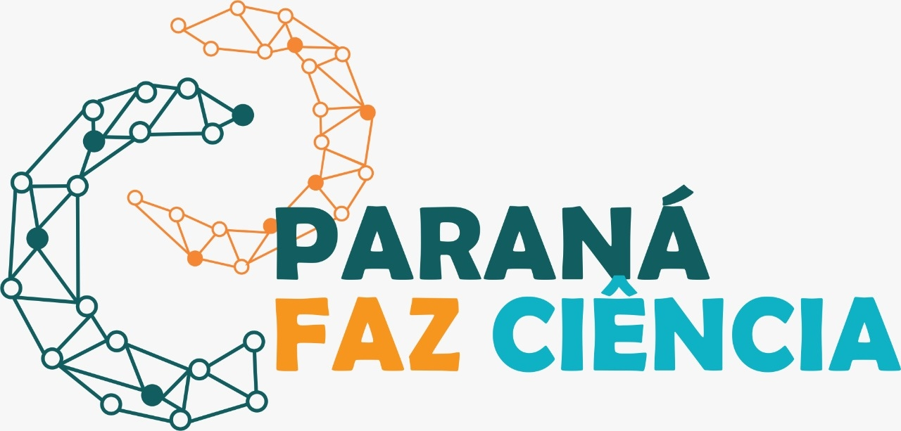

# Etapa 0: Apresentação do Minicurso

### Sobre Mim

  

  Olá! Meu nome é Mateus Falco. Sou um entusiasta da bioinformática e este Curso foi criado para guiar você pelos primeiros e mais importantes passos da análise de dados genômicos.

---

### Objetivo do Curso

 Bem-vindo(a)! 
O objetivo deste curso prático é ensinar o fluxo de trabalho essencial de **Controle de Qualidade (QC)** e **Limpeza (Trimming)** de dados brutos de sequenciamento (NGS). Ao final, você saberá como avaliar a qualidade de seus dados e como prepará-los para análises mais complexas, como o alinhamento.

### Ambiente e Dados

Para facilitar seu aprendizado, este ambiente no Codespaces já vem com:
1.  **Ferramentas Instaladas:** FastQC e Trimmomatic estão prontos para serem usados.
2.  **Dados Pré-carregados:** Os arquivos de exemplo (leituras FASTQ e adaptadores) já estão na pasta `~/data`. Não é necessário fazer nenhum download.

Vamos começar aprendendo (ou relembrando) os comandos básicos do terminal Linux, nossa principal ferramenta de trabalho.

---
### [➡️ Próxima Etapa: Introdução ao Terminal](./ETAPA_01_Introducao_ao_Terminal.md)
