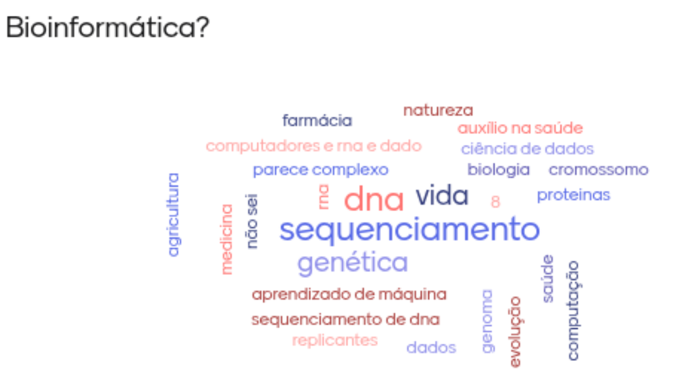
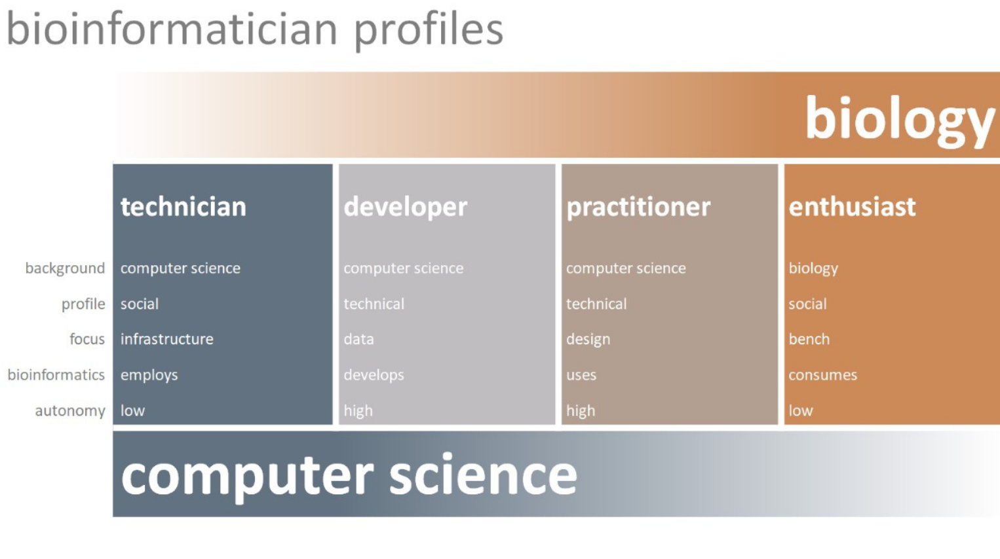
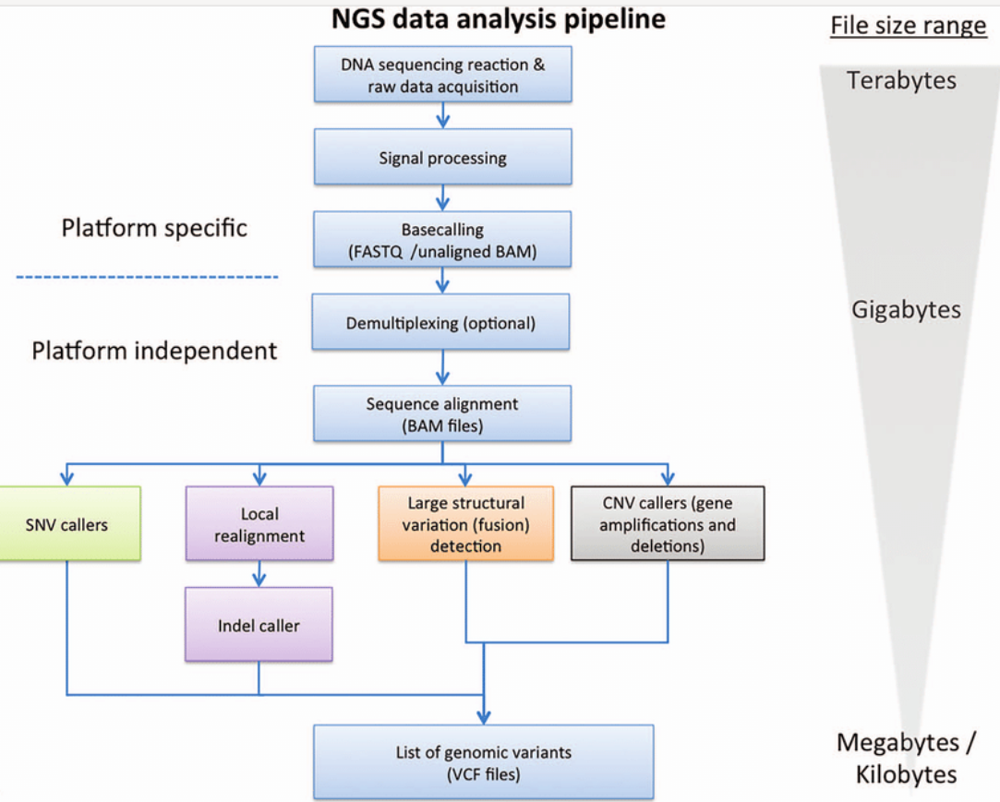
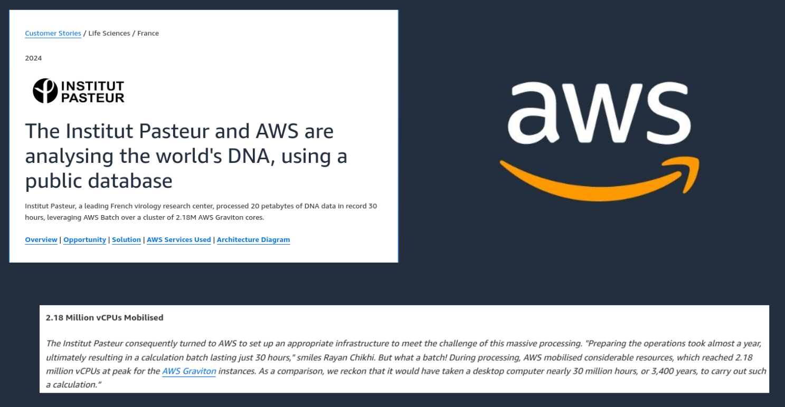
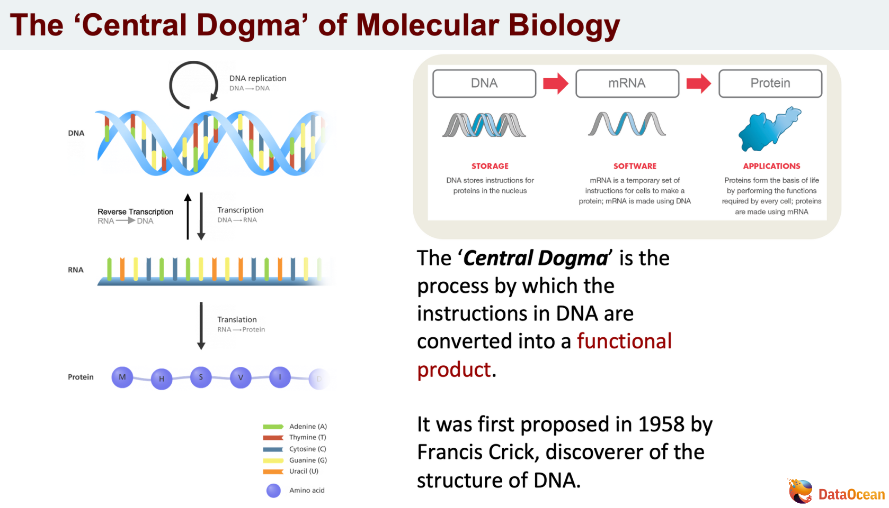
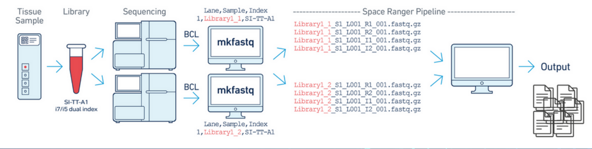
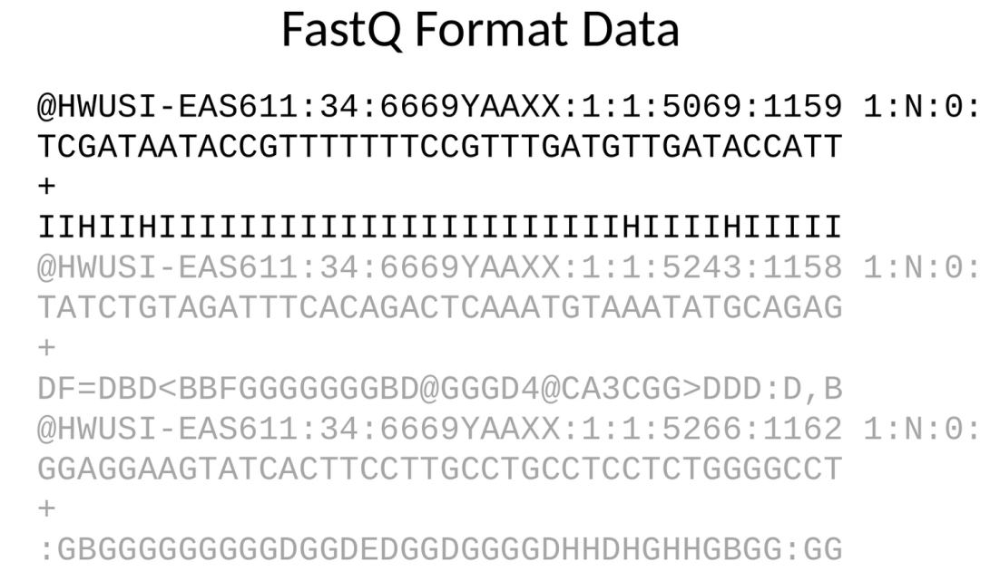
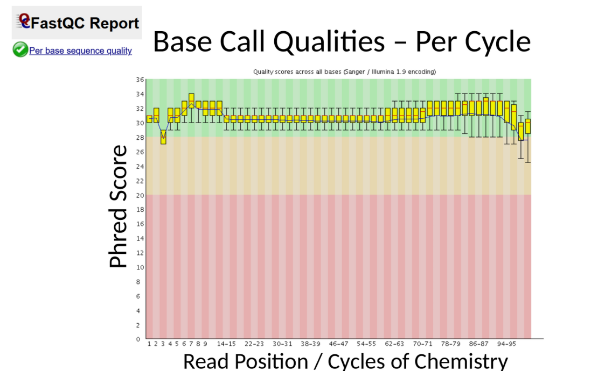
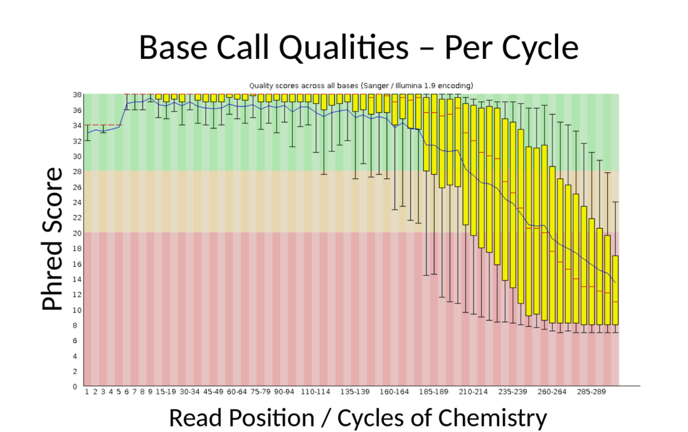
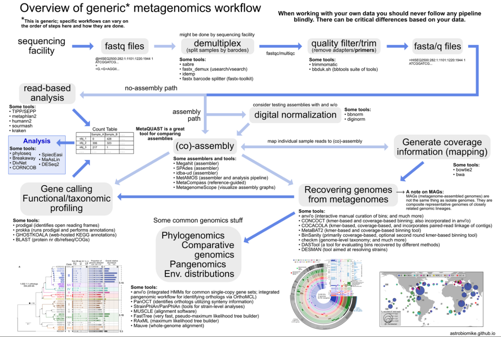

# Etapa 4: Sobre o Curso - Conceitos e Curiosidades

  Esta seção serve como uma base teórica para o nosso minicurso prático. Aqui, vamos explorar o que é a bioinformática, sua importância e os conceitos-chave que você aplicará nas próximas etapas.

---

### Sobre Mim

  

  Olá! Meu nome é Mateus Falco. Sou um entusiasta da bioinformática, com afiliações e parcerias com diversas instituições como a Universidade Estadual de Londrina (UEL), UNICENTRO, MBA USP, Genomas Paraná, Uniguairacá, entre outras.

---

### O que é Bioinformática?

A bioinformática é um campo interdisciplinar que une **Biologia**, **Ciência da Computação** e **Estatística** para analisar e interpretar dados biológicos. Através dela, transformamos informações complexas como sequências de DNA, RNA e proteínas em conhecimento útil. As aplicações são vastas, indo desde a medicina e farmácia até a agricultura e a evolução.

  

> #### Analogia Simples:
> * Nosso corpo é o **Hardware**.
> * O Genoma (nosso DNA) é o **Sistema Operacional**.
> * Um arquivo de DNA pode ser visto como um **arquivo de computador** contendo as instruções da vida.

---

### Quem é o Bioinformata?

É um profissional em transição entre as 3 grandes àreas descritas acima, **Biologia**, **Ciência da Computação** e **Estatística** ressposável por analisar e interpretar dados biológicos e outras tarefas!

  

---

### Como o quê trabalhamos?

A bioinformática trabalha com uma quantidade imensa de dados de sequenciamento, dados clínicos e outros metadados. Sendo assim, requer poderosas ferramentas para processar essa quantidade imensa, além de ferramentas simples como o terminal.

  

---

### Um Caso Curioso: O Poder da Nuvem na Análise de DNA

Para entendermos a escala dos dados em genômica, veja este exemplo impressionante:

O **Institut Pasteur**, um renomado centro de pesquisa francês, em parceria com a Amazon Web Services (AWS), conseguiu processar **20 petabytes de dados de DNA** em apenas **30 horas**.

* **O que isso significa?**
    * A AWS mobilizou um cluster com um pico de **2.18 milhões de processadores virtuais** (vCPUs).
    * Em comparação, um computador de mesa comum levaria cerca de **3.400 anos** para realizar o mesmo cálculo.

Isso demonstra a necessidade de alta capacidade computacional para lidar com os desafios da bioinformática moderna.

  

---

### O Coração da Bioinformática: Sequenciamento

O sequenciamento é o processo de "ler" a ordem das bases (A, C, G, T) em uma molécula de DNA.

  

#### Dogma Central da Biologia Molecular
É o princípio de como a informação genética flui:
1.  **DNA (Armazenamento):** Contém as instruções.
2.  **Transcrição → mRNA (Software):** Uma cópia temporária das instruções é criada.
3.  **Tradução → Proteína (Aplicação):** As instruções são usadas para criar proteínas, que executam as funções vitais.

  

A imagem acima representa o complexo mecanismo de transformação dos dados de imagens do sequenciamento em dados digitais para serem analisados pela bioinformática.

---

### Arquivos e Controle de Qualidade: A Linguagem da Genômica

Após o sequenciamento, os dados brutos são armazenados em formatos de arquivo específicos.

#### Principais Formatos de Arquivo
* **FASTQ (`.fastq`):** O formato padrão para dados brutos de sequenciadores NGS. Cada leitura é representada por 4 linhas:
    1.  **Linha 1:** Identificador da sequência, começando com `@`.
    2.  **Linha 2:** A sequência de bases (os "reads").
    3.  **Linha 3:** Começa com `+`, podendo repetir o identificador.
    4.  **Linha 4:** Os **Phred Quality Scores** para cada base da linha 2.

  

#### Controle de Qualidade (QC)
O **Phred Quality Score (Q score)** é uma medida logarítmica da probabilidade de erro para cada base.
* **Q30:** 1 erro em 1.000 bases (99.9% de acurácia).

Ferramentas como o **FastQC** geram relatórios em HTML que nos permitem visualizar a qualidade das nossas leituras.

Na figura abaixo temos um relatório de boa qualidade de sequenciamento.

  

Contudo, nesta outra imagem o sequenciamento teve alguns problemas e a qualidade ficou abaixo do ideal.

  

---

### O que é um Pipeline de Bioinformática?

Um **pipeline** (ou fluxo de trabalho) é uma sequência de etapas computacionais para processar e analisar os dados brutos, transformando-os em resultados biológicos interpretáveis.

Um pipeline básico geralmente segue estes passos:
1.  **DNA Sample:** A amostra biológica inicial.
2.  **Sequencing → Raw Sequence (FASTA/FASTQ):** Os dados brutos gerados pelo sequenciador.
3.  **Alignment → Aligned Reads (BAM/SAM):** Os "reads" são alinhados contra um genoma de referência.
4.  **Variant Calling → Variant Calls (VCF):** O alinhamento é analisado para identificar variantes.

  

---
### [➡️ Voltar para a Página Inicial](../README.md)
